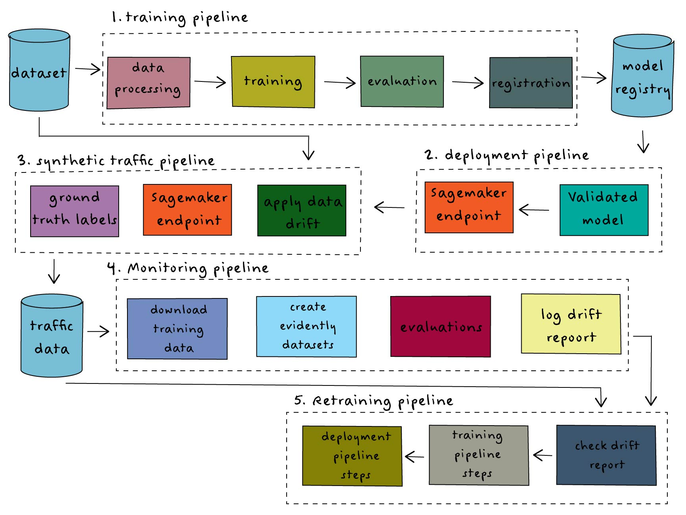

# End-to-end MLOps System on AWS



This is a complete MLOps System designed to automate training, deployment and maintaining a machine learning model. The system implements the following:

Experiment tracking and deployment: MLflow

Model hosting: Amazon Sagemaker 

Monitoring: Evidently AI

Orchestration: Metaflow

The system has been designed to run entirely in the cloud utilising AWS services as illustrated in the above diagram.

## Set up

Firstly, fork and clone this repository to create a local version of the project on your local device.

This project is managed with uv to ensure seamless dependency management and automatic use of the correct Python version.

You can read more on uv, its installation and find a user guide [here](https://docs.astral.sh/uv/getting-started/).

After cloning, run `uv sync` to create the virtual environment and install dependencies from the lockfile.

## MLflow Tracking Server

The MLflow tracking server is location where all model information tracked. You will need provide a URI for the location of the tracking server to run the pipeline.

## Configuring the AWS CLI

To connect with AWS you will need to have the AWS CLI installed and authenticated using IAM credentials.

The installation guide can be found [here](https://docs.aws.amazon.com/cli/latest/userguide/getting-started-install.html).

Next, if you have not already done so, you will need to authenticate the AWS CLI. The authentication guide can be found here.

Next you next you need to create an IAM Role using the CloudFormation template: `cloudformation/continous-training.yaml`  

Then IAM Role created using this template can be used to authenticate the AWS CLI.

## Configuring AWS with Metaflow

To configure the configure the client-side of Metaflow to be aware of available AWS  we must configure the user-specific configuration file `~/.metaflowconfig/`  stored in the users home directory.

A guide on how to configure Metaflow with AWS services can be found [here](https://docs.outerbounds.com/engineering/operations/configure-metaflow/)

Additional Steps

Ensure you provide AWS Batch with permissions to access S3 and Sagemaker by adding the necessary permissions to the role  assigned to the `METAFLOW_ECS_S3_ACCESS_IAM_ROLE` environment variable.

## Training Pipeline

The training pipeline downloads the penguins dataset from an S3 bucket and pre-processes it for training. It then trains a random forrest classifier model using Ramdomised Search Cross Validation to find the best performing combination of hyper-parameters. 

If the best performing model meets a validation threshold, it is registered in the MLflow model registry using a custom MLflow Pyfunc wrapper (model.py) with code to capture inference traffic in an PostgreSQL database.

⚪  Download data from S3

⚪ Model and other artfifacts for the validated model stored in S3

⚪Experiment tracking data logged using RDS backend store

To create a state machine for the Training flow in Step Function run the following command:

```bash
uv run python -m flows.training_flow --environment=pypi \
--with retry step-functions create
```

To trigger the state machine:

```bash
uv run python -m flows.training_flow \
--environment=pypi \
step-functions trigger \
--rds_uri '<data_capture_uri>' \
--mlflow_tracking_uri "<mlflow_tracking_uri>" \
--mlflow_experiment_name "continous-training" \
--s3_dataset_uri "<s3_dataset_uri>"
```

## Deployment Pipeline

The deployment pipeline retrieves the latest validated model from the model registry and deploys it to Amazon Sagemaker.

⚪ Registered model retrieved from MLflow S3 artifact store

⚪ Model deployed to Amazon Sagemaker

To deploy the model to Sagemaker we need to build a docker image compatible with Sagemaker and push it to Amazon ECR. To this, run the following command:

```bash
mlflow sagemaker build-and-push-container
```

Next get the image url using the following command:

```bash
aws ecr describe-repositories \
  --repository-names mlflow-pyfunc \
  --region <enter-your-region> \
  --query 'repositories[0].repositoryUri' \
  --output text | \
xargs -I{} sh -c \
  'echo "{}:$(aws ecr describe-images \
    --repository-name mlflow-pyfunc \
    --region <enter-your-region> \
    --query "sort_by(imageDetails, &imagePushedAt)[-1].imageTags[0]" \
    --output text)"'
```

This will print the image url to the console.

To create a state machine for the Deployment flow in Step Function run the following command:

```bash
uv run python -m flows.deployment_flow \
--environment=pypi \
--with retry step-functions create
```

The following command will trigger the state machine in Step Functions. `<sagemaker-role-arn>` is the role created by the earlier cloudformation template, `"<ecr-image-uri>"`  is the image url generated earlier.

```bash
uv run python -m flows.deployment_flow \
--environment=pypi \
step-functions trigger \
--mlflow_tracking_uri "<mlflow_tracking_uri>" \
--sagemaker_role "<sagemaker-role-arn>" \
--ecr_image_uri "<ecr-image-uri>"

```

## Synthetic Traffic Pipeline

The synthetic traffic pipeline serves the following purposes:

- Generates traffic to send to the endpoint
- Replicates the process of a labelling team to enable monitoring
- Replicates production conditions by applying drift to input features

The original training dataset is retrieved from the MLflow S3 artifact store and numpy is used to apply drift to input features. This data is sent to the deployed endpoint in batches for inference. All inference data is captured automatically (implemented by the custom pyfunc). The inference data is then retrieved and synthetic ground truth labels are created.

⚪ Training data retrieved from MLflow artifact store

⚪ Synthetic traffic sent to Amazon Sagemaker endpoint

⚪ Inference data captured, labelled and stored in an RDS database

To create a state machine for the Sythetic Traffic flow in Step Function run the following command:

```bash
uv run python -m flows.traffic_flow --environment=pypi \
--with retry step-functions create
```

To trigger the state machine:

```bash
uv run python -m flows.traffic_flow --environment=pypi \
step-functions trigger \
--mlflow_tracking_uri "<mlflow_tracking_uri>" \
--flow_type "<traffic-or-labelling" \
--rds_uri '<data_capture_uri>'
```

## Monitoring Pipeline

The monitoring pipeline compares the current production data generated in the synthetic traffic pipeline with the reference training dataset. The Evidently AI library is used to perform drift detection.  The deployed model is tagged with the outcome of the drift evaluation.

diagram anotations:

⚪ Training data retrieved from MLflow S3 artifact store

⚪ Inference data retrieved from RDS database

To create a state machine for the Monitoring flow in Step Function run the following command:

```bash
uv run python -m flows.monitoring_flow --environment=pypi \
--with retry step-functions create
```

To trigger the state machine:

```bash
uv run python -m flows.monitoring_flow --environment=pypi \
step-functions trigger \
--mlflow_tracking_uri "<mlflow_tracking_uri>" \
--rds_uri '<data_capture_uri>' \
--s3_uri "<s3-drift-report-bucket>"
```

## Retraining pipeline

The retraining pipeline uses the captured inference data to retrain the model if drift was detected in the monitoring pipeline. If the newly trained model meets a validation threshold the Sagemaker deployment is updated with the new model.

⚪ Inference data retrieved from the RDS database

⚪ Validated models are registered

⚪ Sagemaker deployment updated with validated model

To create a state machine for the Retraining flow in Step Function run the following command:

```bash
uv run python -m flows.retraining_flow --environment=pypi \
--with retry step-functions create
```

To trigger the state machine:

```bash
uv run python -m flows.retraining_flow --environment=pypi \
step-functions trigger \
--mlflow_tracking_uri "<mlflow_tracking_uri>" \
--rds_uri "<data_capture_uri>" \
--sagemaker_role "<sagemaker-role-arn>" \
--ecr_image_uri "<ecr-image-uri>"
```
⚪Experiment tracking data logged using RDS backend store

To create a state machine for the Training flow in Step Function run the following command:

```bash
uv run python -m flows.training_flow --environment=pypi \
--with retry step-functions create
```

To trigger the state machine:

```bash
uv run python -m flows.training_flow \
--environment=pypi \
step-functions trigger \
--rds_uri '<data_capture_uri>' \
--mlflow_tracking_uri "<mlflow_tracking_uri>" \
--mlflow_experiment_name "continous-training" \
--s3_dataset_uri "<s3_dataset_uri>"
```

## Deployment Pipeline

The deployment pipeline retrieves the latest validated model from the model registry and deploys it to Amazon Sagemaker.

⚪ Registered model retrieved from MLflow S3 artifact store

⚪ Model deployed to Amazon Sagemaker

To deploy the model to Sagemaker we need to build a docker image compatible with Sagemaker and push it to Amazon ECR. To this, run the following command:

```bash
mlflow sagemaker build-and-push-container
```

Next get the image url using the following command:

```bash
aws ecr describe-repositories \
  --repository-names mlflow-pyfunc \
  --region <enter-your-region> \
  --query 'repositories[0].repositoryUri' \
  --output text | \
xargs -I{} sh -c \
  'echo "{}:$(aws ecr describe-images \
    --repository-name mlflow-pyfunc \
    --region <enter-your-region> \
    --query "sort_by(imageDetails, &imagePushedAt)[-1].imageTags[0]" \
    --output text)"'
```

This will print the image url to the console.

To create a state machine for the Deployment flow in Step Function run the following command:

```bash
uv run python -m flows.deployment_flow \
--environment=pypi \
--with retry step-functions create
```

The following command will trigger the state machine in Step Functions. `<sagemaker-role-arn>` is the role created by the earlier cloudformation template, `"<ecr-image-uri>"`  is the image url generated earlier.

```bash
uv run python -m flows.deployment_flow \
--environment=pypi \
step-functions trigger \
--mlflow_tracking_uri "<mlflow_tracking_uri>" \
--sagemaker_role "<sagemaker-role-arn>" \
--ecr_image_uri "<ecr-image-uri>"

```

## Synthetic Traffic Pipeline

The synthetic traffic pipeline serves the following purposes:

- Generates traffic to send to the endpoint
- Replicates the process of a labelling team to enable monitoring
- Replicates production conditions by applying drift to input features

The original training dataset is retrieved from the MLflow S3 artifact store and numpy is used to apply drift to input features. This data is sent to the deployed endpoint in batches for inference. All inference data is captured automatically (implemented by the custom pyfunc). The inference data is then retrieved and synthetic ground truth labels are created.

⚪ Training data retrieved from MLflow artifact store

⚪ Synthetic traffic sent to Amazon Sagemaker endpoint

⚪ Inference data captured, labelled and stored in an RDS database

To create a state machine for the Sythetic Traffic flow in Step Function run the following command:

```bash
uv run python -m flows.traffic_flow --environment=pypi \
--with retry step-functions create
```

To trigger the state machine:

```bash
uv run python -m flows.traffic_flow --environment=pypi \
step-functions trigger \
--mlflow_tracking_uri "<mlflow_tracking_uri>" \
--flow_type "<traffic-or-labelling" \
--rds_uri '<data_capture_uri>'
```

## Monitoring Pipeline

The monitoring pipeline compares the current production data generated in the synthetic traffic pipeline with the reference training dataset. The Evidently AI library is used to perform drift detection.  The deployed model is tagged with the outcome of the drift evaluation.

diagram anotations:

⚪ Training data retrieved from MLflow S3 artifact store

⚪ Inference data retrieved from RDS database

To create a state machine for the Monitoring flow in Step Function run the following command:

```bash
uv run python -m flows.monitoring_flow --environment=pypi \
--with retry step-functions create
```

To trigger the state machine:

```bash
uv run python -m flows.monitoring_flow --environment=pypi \
step-functions trigger \
--mlflow_tracking_uri "<mlflow_tracking_uri>" \
--rds_uri '<data_capture_uri>' \
--s3_uri "<s3-drift-report-bucket>"
```

## Retraining pipeline

The retraining pipeline uses the captured inference data to retrain the model if drift was detected in the monitoring pipeline. If the newly trained model meets a validation threshold the Sagemaker deployment is updated with the new model.

⚪ Inference data retrieved from the RDS database

⚪ Validated models are registered

⚪ Sagemaker deployment updated with validated model

To create a state machine for the Retraining flow in Step Function run the following command:

```bash
uv run python -m flows.retraining_flow --environment=pypi \
--with retry step-functions create
```

To trigger the state machine:

```bash
uv run python -m flows.retraining_flow --environment=pypi \
step-functions trigger \
--mlflow_tracking_uri "<mlflow_tracking_uri>" \
--rds_uri "<data_capture_uri>" \
--sagemaker_role "<sagemaker-role-arn>" \
--ecr_image_uri "<ecr-image-uri>"
```