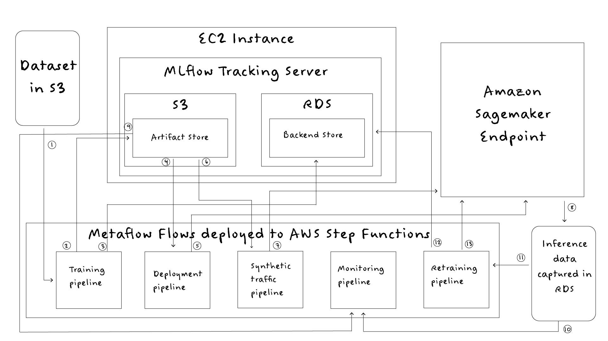

# End-to-end MLOps System on AWS

This is a complete MLOps System designed to automate training, deployment and maintaining a machine learning model. The system implements the following:

Experiment tracking and deployment: MLflow

Model hosting: Amazon Sagemaker 

Monitoring: Evidently AI

Orchestration: Metaflow

The system has been designed run entirely in the cloud utilising AWS services as illustrated in the above diagram.

## Training Pipeline

The training pipeline downloads the penguins dataset from an S3 bucket and pre-processes it for training. It then trains a random forrest classifier model using Ramdomised Search Cross Validation to find the best performing combination of hyper-parameters. 

If the best performing model meets a validation threshold, it is registered in the MLflow model registry using a custom MLflow Pyfunc wrapper (model.py) with code to capture inference traffic in an PostgreSQL database.

diagram anotations:

1️⃣  Download data from S3

2️⃣  Model and other artfifacts for the validated model stored in S3

3️⃣ Experiment tracking data logged using RDS backend store

## Deployment Pipeline

The deployment pipeline retrieves the latest validated model from the model registry and deploys it to Amazon Sagemaker.

diagram anotations:

4️⃣ Registered model retrieved from MLflow S3 artifact store

5️⃣ Model deployed to Amazon Sagemaker

## Synthetic Traffic Pipeline

The synthetic traffic pipeline serves the following purposes:

- Generates traffic to send to the endpoint
- Replicates the process of a labelling team to enable monitoring
- Replicates production conditions by applying drift to input features

The original training dataset is retrieved from the MLflow S3 artifact store and numpy is used to apply drift to input features. This data is sent to the deployed endpoint in batches for inference. All inference data is captured automatically (implemented by the custom pyfunc). The inference data is then retrieved and synthetic ground truth labels are created.

diagram anotations:

6️⃣ Training data retrieved from MLflow artifact store

7️⃣ Synthetic traffic sent to Amazon Sagemaker endpoint

8️⃣ Inference data captured, labelled and stored in an RDS database

## Monitoring Pipeline

The monitoring pipeline compares the current production data generated in the synthetic traffic pipeline with the reference training dataset. The Evidently AI library is used to perform drift detection.  The deployed model is tagged with the outcome of the drift evaluation.

diagram anotations:

9️⃣ Training data retrieved from MLflow S3 artifact store

🔟 Inference data retrieved from RDS database

## Retraining pipeline

The retraining pipeline uses the captured inference data to retrain the model if drift was detected in the monitoring pipeline. If the newly trained model meets a validation threshold the Sagemaker deployment is updated with the new model.

diagram anotations:

1️⃣1️⃣ Inference data retrieved from the RDS database

1️⃣2️⃣ Validated models are registered

1️⃣3️⃣ Sagemaker deployment updated with validated model